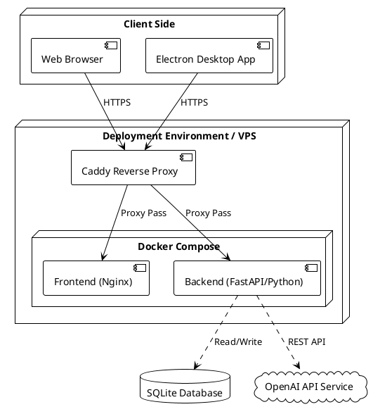
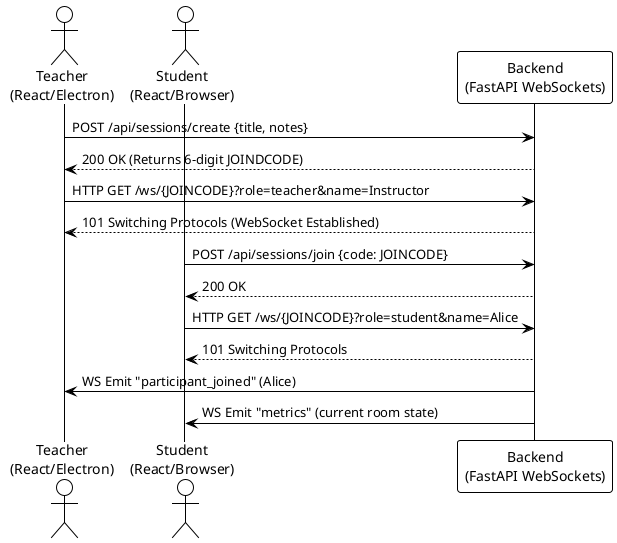
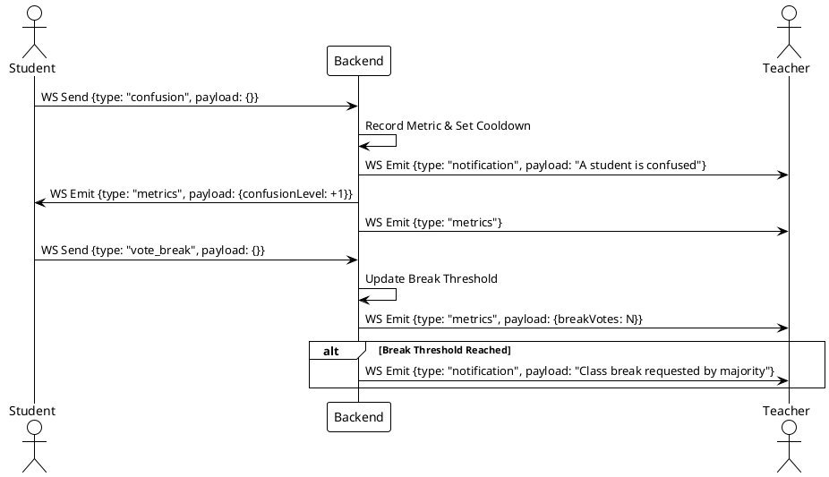
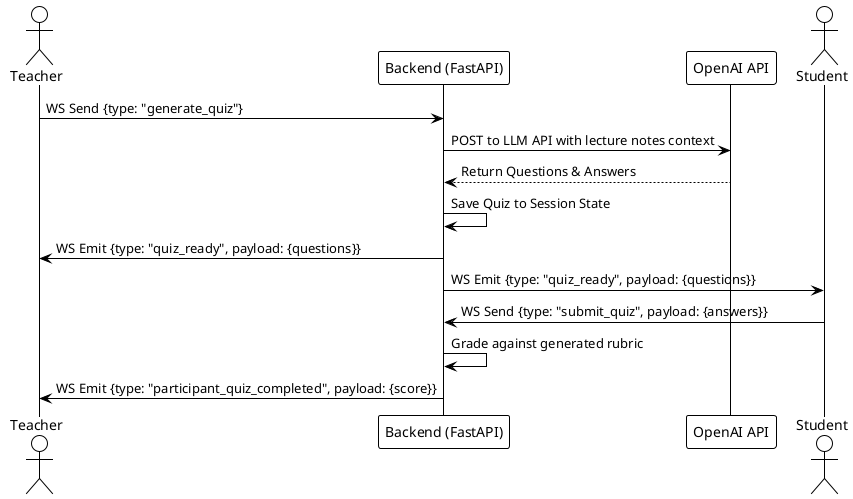

# System Architecture

## Overview
The application is a full-stack real-time interactive learning and classroom management platform, designed to enhance the engagement between teachers and students during live sessions.

It encompasses three main components:
1. **Frontend**: A React application (built with Vite) that provides interfaces for both teachers and students.
2. **Backend**: A FastAPI server that handles persistent storage (SQLite), AI workloads (OpenAI integrations for quiz generation), and real-time state management via WebSockets.
3. **Desktop app**: An Electron wrapper wrapper packaging the Frontend for standalone distribution (AppImage, deb, rpm, exe, dmg).

## Deployment Architecture

## System Components

- **Caddy**: Serves as the SSL termination and reverse proxy layer, routing `/api` and `/ws` to the Backend, and the rest to the Frontend.
- **Frontend Container**: Nginx server delivering static assets (HTML, CSS, JS) efficiently.
- **Backend Container**: Uvicorn server running the FastAPI application. It persists session state in memory (for real-time WebSockets tracking) and long-term analytics/documents to an embedded SQLite file (`data.sqlite3`).

---

## High-Level Sequence Diagrams

### 1. Session Connection & Live Share

When a session starts, both the teacher and students connect to the room via WebSockets to synchronize state.

### 2. Notifications & Student Feedback (Confusion Signals & Break Votes)

The system allows students to push real-time, anonymous or attributed feedback to the teacher's dashboard without interrupting the flow verbally.

### 3. AI-Driven Live Quizzes

Teachers can trigger live quizzes generated from the current session's materials (like uploaded PDFs or live shared notes).

## Definition of Done Guidelines

- Ensure both API calls (`/api`) and WebSockets (`/ws`) are routing successfully through the reverse proxy.
- Ensure that the state isn't lost for users actively connected to WebSockets.
- Data persistence is tracked directly on the server's mount in SQLite.
