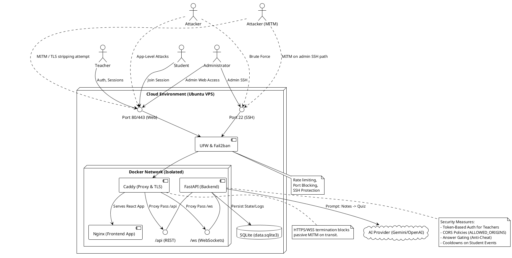

# VIA Live - Security Architecture & Threat Model

This document outlines the security features, potential attack surfaces, and a comprehensive mapping of endpoints implemented in the VIA Live platform. It serves as a continuous reference for safe deployment, operations, and future development.

## 1. Security Architecture Diagram

The system's security boundaries, components, and typical network traffic flows:

Source diagram: [docs/diagrams/security_architecture.puml](diagrams/security_architecture.puml)

---

## 2. Implemented Security Features

### 2.1 Infrastructure & Deployment Security
- **SSH Hardening:** Direct root login (`PermitRootLogin no`) and password authentication (`PasswordAuthentication no`) are completely disabled. 
- **Key-Based Auth:** Access implies successful SSH Public Key authentication.
- **Firewall (UFW):** Strict allow-list only permitting ports `22` (SSH), `80` (HTTP), and `443` (HTTPS). Everything else is denied.
- **Intrusion Prevention (Fail2ban):** Protects the SSH surface from brute-force botnets via automatic banning.
- **OOM Protection:** Implementations of bounded/allocated swap areas before package installation/building prevent uncontrolled Out-of-Memory kernel panics on small cloud droplets.
- **Automated Patching:** `unattended-upgrades` are running for seamless, zero-intervention security updates to the Ubuntu container host.

### 2.2 Application-Level Security
- **Transport Security:** Auto-renewing Let's Encrypt / ZeroSSL TLS termination via Caddy protects all data-in-transit, establishing required secure contexts for WebRTC and WebSockets.
- **REST Token Authentication:** Token-based access (JWT/Bearer) securing teacher/admin functions.
- **Cross-Origin Restrictions:** Bounded CORS policies via explicitly allowed domains (`ALLOWED_ORIGINS` mapped dynamically).
- **Anti-Cheat Mechanics:** Backend quiz systems feature intentional state separation. While a quiz is continuously broadcast to students ('live'), the `correct_option_id` is hidden / redacted (`answer_revealed=false`). Reveal occurs only *after* the teacher explicitly closes the poll.
- **Event Spam Mitigations:** 
  - *Break Votes:* Governed by rate-limiting/cooldown to prevent WebSocket spam.
  - *Confusion Rating:* Capped per student. Successive clicks register as timestamp updates instead of numeric accumulation, preventing UI-level "griefing" on the teacher's stage.
- **Secret Hygiene:** Environment values (`.env`) strictly decoupled from `.env.example`. Documentation asserts immediate rotation and `git rm --cached` handling of accidental leakages.

---

## 3. Threat Model & Attack Surfaces

### 3.1 Network / Infrastructure Layer
- **Attack Surface:** Exposed SSH (port 22).
  - *Threat:* Continuous automated brute forcing. 
  - *Mitigation:* Key-based auth + fail2ban blocking.
- **Attack Surface:** Web/App Ports (80/443).
  - *Threat:* Application Layer DDoS / Slowloris. 
  - *Mitigation:* Caddy standard timeouts + Docker container limits. Can be further mitigated by cloud WAF (e.g. Cloudflare).
- **Attack Surface:** WebRTC Connection Setup (Browser to Browser).
  - *Threat:* IP Address disclosure through STUN/TURN traversal.
  - *Mitigation:* Acceptable risk for general class setups, though standard browser privacy settings can govern precise IP masking.

### 3.2 Application / API Layer
- **Attack Surface:** WebSocket connections (`/ws/{code}`).
  - *Threat:* Session flooding (a bot joining a session code multiple times) and Event spam (sending continuous malformed packets).
  - *Mitigation:* Backend limits confusion/break triggers. *Future improvement:* Restrict Max-Connections per IP.
- **Attack Surface:** LLM Integrations (Gemini / OpenAI API calls).
  - *Threat:* Prompt Injection. A malicious teacher or injected text within uploaded presentation notes could attempt to jailbreak the LLM to output malicious payloads or manipulate the JSON structure.
  - *Mitigation:* Structured payload guardrails, and enforcing rigid JSON schema parsing in FastAPI before sending to the front end.
- **Attack Surface:** Presentation File Uploads (`/api/presentations`).
  - *Threat:* Malicious file (e.g., malware, enormous files) uploaded as a presentation.
  - *Mitigation:* FastApi file-size constraints. Missing strict MIME-checking represents a future task.
- **Attack Surface:** Stored Cross-Site Scripting (XSS).
  - *Threat:* Injecting `<script>` tags into student names or typed anonymous questions.
  - *Mitigation:* By default, modern React strictly limits arbitrary HTML injection via automatic escaping of properties and state bindings.

---

## 4. Complete Endpoint Compendium

### 4.1 FastAPI REST Endpoints

| Endpoint | Method | Auth Required | Purpose | Security Context / Notes |
| :--- | :--- | :--- | :--- | :--- |
| `/health` | `GET` | No | System liveness probe. | Read-only state. |
| `/api/auth/register` | `POST` | No | Creates a new account. | Passwords should be hashed/salted. |
| `/api/auth/login` | `POST` | No | Issues an authentication token. | Grants privileged context. |
| `/api/auth/me` | `GET` | **Yes** | Fetches the authenticated profile. | Validates Authorization Header. |
| `/api/sessions` | `POST` | **Yes** | Initializes a teacher session. | Issues the active randomly generated 6-digit `JOINCODE`. |
| `/api/sessions/{code}/analytics` | `GET` | **Yes** | Yields active session analytics. | Access control validates session host. |
| `/api/library/sessions` | `GET` | **Yes** | Historical data of host sessions. | Database filtered by user logic. |
| `/api/presentations` | `POST` | **Yes** | Uploads presentation materials. | *Risk: File upload vector.* Requires validation. |
| `/api/presentations` | `GET` | **Yes** | Fetches user's presentations. | Read-only list. |
| `/api/presentations/{id}/download` | `GET` | **Yes** | Returns the raw uploaded file. | Bounded path read from `uploads/`. |
| `/api/presentations/{id}/notes-png`| `POST` | **Yes** | Generates notes and renders PNG. | Utilizes AI. Potential LLM injection vector. |
| `/api/quizzes/save` | `POST` | **Yes** | Adds generated quiz to library. | Inserts to `saved_quizzes` table. |
| `/api/quizzes` | `GET` | **Yes** | Lists host's saved quizzes. | Read-only. |

### 4.2 WebSocket Endpoints

| Connection URI | Role Argument | Visibility | Core Events (Receivable) | Purpose / Security Mechanics |
| :--- | :--- | :--- | :--- | :--- |
| `/ws/{code}?role=teacher&name=...` | `teacher` | Host Only | `generate_quiz`, `explain_screen`, `end_session` | Acts as the control plane. Trusted with kicking students, closing quizzes, and evaluating actual LLM tasks. |
| `/ws/{code}?role=student&name=...` | `student` | Public (Requires `code`) | `confusion`, `vote_break`, `submit_quiz`, `ask_question`, `explain_screen` | Limited plane. Events pushed from here are inherently mistrusted. Capped metrics, missing answers payload (`answer_revealed=false`), and cooldown timers apply to all emitted state. |

**Important WS Structural Threat:**
All WebSockets share real-time state and maintain SQLite event logs. Because a `JOINCODE` is 6 alphanumerics, there is theoretically a brute-force possibility for an attacker to query codes. However, unauthenticated access merely drops them blindly into a session as a "student" without any elevated REST privileges.
